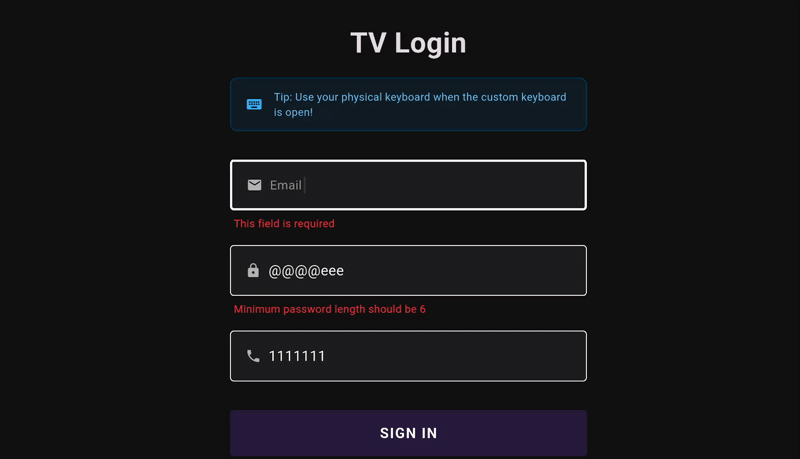

# Custom TV Text Field 📺

<p align="center">
  
</p>

### The Ultimate Flutter Text Input Solution for Android TV, and Smart TV Platforms.

[](https://pub.dev/packages/custom_tv_text_field)
[](https://pub.dev/packages/custom_tv_text_field)

`custom_tv_text_field` is a premium, high-performance Flutter package designed to solve the common struggles of text input on TV devices. It provides a fully customizable **on-screen virtual keyboard** and a **TV-optimized text field** that works perfectly with **D-pad remote control navigation**.

---

## 🚀 Why use this for your TV App?

Standard Flutter `TextField` widgets are often difficult to use with a TV remote. This package bridges that gap by providing:
- **Seamless D-Pad Navigation**: No more fighting with focus nodes; navigate keys with arrow keys effortlessly.
- **Visual Feedback**: Highly visible focus indicators designed for 10-foot UI standards.
- **Dual Input Mastery**: Use the virtual keyboard or a physical connected keyboard simultaneously.

## ✨ Key Features

- **📺 TV-Native Keyboard**: Custom layouts designed for large screens and remote control clicks.
- **⌨️ Physical Keyboard Support**: Modern implementation using `Focus` + `onKeyEvent` — type instantly with hardware keyboards.
- **✅ Auto-Validation**: Built-in support for **Email, Password, Numbers, URL, and Username** via `TextFieldType`.
- **🎮 Remote Control Optimization**: Full handling of **Arrow Up/Down/Left/Right, Enter/Select, and Back/Escape**.
- **💎 Premium Design**: Smooth animations, glassmorphism-ready overlays, and professional aesthetics.
- **📝 Form Support**: Works perfectly with `Form`, `GlobalKey<FormState>`, and standard `TextEditingController`.
- **⚙️ Zero Config**: Drop it into your login or search screens and it just works.

## 📱 Platform Support

Optimized for the following **Leanback/TV** platforms:
- **Android TV / Google TV** (Xiaomi TV, Philips TV, Sony, Mi Box, TCL, etc.)
- **Amazon Fire TV Stick**
- **Smart TV Browsers & OS** (Tizen OS, WebOS via Flutter Web)

## Installation

Add the following to your `pubspec.yaml`:

```yaml
dependencies:
  custom_tv_text_field: ^1.0.0
```

## Usage

```dart
import 'package:custom_tv_text_field/custom_tv_text_field.dart';

// ... inside your widget tree
CustomTVTextField(
  controller: myController,
  hint: 'Enter your email',
  textFieldType: TextFieldType.email,
  isRequired: true,
  isFocused: true, // Handle focus state for TV navigation
)
```

## Validation

The package supports automated validation through `TextFieldType`:

- `TextFieldType.email`: Validates email patterns.
- `TextFieldType.password`: Minimum length of 6 characters.
- `TextFieldType.phone` / `TextFieldType.number`: Numeric validation.
- `TextFieldType.username`: Space-free strings.
- `TextFieldType.url`: Valid absolute URIs.

## Focus Management

Since this is built for TV, you manage `isFocused` state externally to handle D-pad navigation between fields.

```dart
CustomTVTextField(
  isFocused: _currentSection == LoginSection.email,
  // ...
)
```

## Physical Keyboard Support

The custom keyboard now supports physical keyboard input using Flutter's modern `Focus` + `onKeyEvent` API. When the custom keyboard overlay is open, users can type using either:

- **The virtual on-screen keyboard** (click keys with mouse/touch or navigate with D-pad)
- **Their physical keyboard** (type directly!)

### Supported Input

✅ **Lowercase letters**: a, b, c, ..., z  
✅ **Uppercase letters**: A, B, C, ..., Z (with Shift)  
✅ **Numbers**: 0, 1, 2, ..., 9  
✅ **Special characters**: !, @, #, $, %, ^, &, *, etc.  
✅ **Space**: Space bar  
✅ **Backspace**: Remove last character  

### How It Works

The implementation uses `event.character` to accurately detect printable characters, which means:

- **Automatic modifier handling**: Shift+A gives you "A", Shift+1 gives you "!"
- **International keyboard support**: Works with different keyboard layouts
- **Smart filtering**: Only accepts printable characters (ASCII 32-126 and UTF-8)

### Example

```dart
final _controller = TextEditingController();
final _fieldKey = GlobalKey<CustomTVTextFieldState>();

// In your build method:
CustomTVTextField(
  key: _fieldKey,
  controller: _controller,
  hint: 'Type something...',
  keyboardType: KeyboardType.alphabetic,
  onFieldSubmitted: (text) {
    print('You typed: $text');
  },
)

// Open the keyboard programmatically:
_fieldKey.currentState?.openKeyboard();
```

Once the keyboard is open, users can type using their physical keyboard seamlessly!

For more technical details, see [KEYBOARD_LISTENING.md](KEYBOARD_LISTENING.md).

---

## 🤝 Contribution & Support

Found a bug or have a feature request?
- Open an [Issue](https://github.com/FlutterTechs/custom_tv_text_field/issues)
- Reach out to the [maintainer](https://github.com/FlutterTechs)

Developed with ❤️ for the Flutter TV Community.

---
**Keywords**: Flutter Android TV, Smart TV Keyboard, Remote Control Input, D-Pad Navigation, TV Login Screen, Search Bar TV, Xiaomi TV, Philips TV, Tizen OS, Fire TV Stick Flutter.
